# 📱 DacSanViet Mobile App - TypeScript Version

Ứng dụng di động React Native được phát triển bằng TypeScript với tích hợp API backend hoàn chỉnh, hỗ trợ xác thực JWT và OTP qua email.

## 🚀 Tính năng chính

### 🔐 Xác thực & Bảo mật

- **Đăng ký tài khoản** với xác thực OTP qua email
- **Đăng nhập** với JWT tokens (Access & Refresh)
- **Quên mật khẩu** với OTP verification
- **Đặt lại mật khẩu** an toàn
- **Session management** tự động
- **Profile Security** với JWT-OTP cho mọi thay đổi quan trọng
- **Đổi mật khẩu** với OTP verification
- **Đổi email** với OTP gửi về email hiện tại (bảo mật cao)
- **Đổi số điện thoại** với OTP verification
- **Avatar upload** với image picker và validation

### 🎨 Giao diện người dùng

- **Grab-inspired Homepage** với UI/UX hiện đại
- **Modular Component Architecture** dễ bảo trì
- **Custom OTP Input** với animation đẹp mắt
- **Profile Management** hoàn chỉnh với inline editing
- **Avatar Upload** với camera icon overlay
- **Product Cards** với hình ảnh và giảm giá
- **Service Grid** 4x2 cho danh mục sản phẩm
- **Custom Tab Bar** với animations
- **Responsive design** tương thích đa thiết bị
- **Loading states** và error handling
- **Logout functionality** với confirmation dialog

### 🛠 Công nghệ sử dụng

- **React Native** với TypeScript
- **Expo SDK** cho development
- **React Navigation** v6 (Stack + Bottom Tabs)
- **NativeWind** (Tailwind CSS for React Native)
- **React Native Paper** cho Material Design components
- **Axios** cho API calls
- **AsyncStorage** cho local storage
- **Zustand** cho state management
- **MaterialCommunityIcons** icons

## 📋 Yêu cầu hệ thống

- Node.js >= 16.0.0
- npm hoặc yarn
- Expo CLI
- Android Studio (cho Android)
- Xcode (cho iOS)

## 🔧 Cài đặt và chạy

### 1. Clone repository

```bash
git clone <repository-url>
cd BaiTapTuan1_TypeScript
```

### 2. Cài đặt dependencies

```bash
npm install
# hoặc
yarn install
```

### 3. Khởi động API server

```bash
cd ../GroupAPI_JWT_OTP
npm install
npm start
```

### 4. Cấu hình API endpoint

**Cách nhanh (Tự động):**
```bash
npm run setup
```

**Cách thủ công:**
```bash
# Copy template
cp .env.example .env

# Cập nhật IP tự động
npm run update-ip

# Hoặc chỉnh sửa .env thủ công
```

**Tìm IP của máy tính:**
```bash
# macOS/Linux
ifconfig | grep "inet " | grep -v 127.0.0.1

# Windows
ipconfig
```

### 5. Chạy ứng dụng

```bash
# Khởi động Expo
npm start

# Hoặc chạy trực tiếp
npm run android  # Cho Android
npm run ios      # Cho iOS
```

## 📂 Cấu trúc dự án

```
BaiTapCaNhan/
├── components/              # Reusable components
│   ├── OTPInput.tsx        # Custom OTP input
│   ├── CustomTabBar.tsx    # Custom bottom tab bar
│   ├── HomepageHeader.tsx  # Homepage header with search
│   ├── ServiceGrid.tsx     # Service category grid
│   ├── ProductSection.tsx  # Horizontal product list
│   ├── PromoBanner.tsx     # Promotional banner
│   ├── RecommendationSection.tsx # Product recommendations
│   └── UserProfileModal.tsx # User profile popup
├── screens/                # App screens (Feature-based organization)
│   ├── index.ts           # Central export file
│   ├── onboarding/        # Onboarding & intro screens
│   │   ├── index.ts
│   │   ├── IntroScreen.tsx
│   │   └── WelcomeScreen.tsx
│   ├── auth/              # Authentication screens
│   │   ├── index.ts
│   │   ├── LoginScreen.tsx
│   │   ├── RegisterScreen.tsx
│   │   ├── ForgotPasswordScreen.tsx
│   │   ├── OTPVerificationScreen.tsx
│   │   └── ResetPasswordScreen.tsx
│   ├── main/              # Main app screens
│   │   ├── index.ts
│   │   ├── HomepageScreen.tsx    # Main homepage (Grab-inspired)
│   │   ├── SearchScreen.tsx
│   │   └── CartScreen.tsx
│   └── profile/           # Profile management screens
│       ├── index.ts
│       ├── AccountScreen.tsx     # Account management with logout
│       ├── ProfileScreen.tsx     # Profile management with inline editing
│       ├── ChangePasswordScreen.tsx # Change password with OTP
│       ├── ChangeEmailScreen.tsx    # Change email with OTP
│       └── ChangePhoneScreen.tsx    # Change phone with OTP
├── navigation/             # Navigation setup
│   ├── AppNavigator.tsx   # Stack navigator
│   └── MainTabNavigator.tsx # Bottom tab navigator
├── services/              # Services layer
│   ├── api.ts            # API client & methods
│   └── mockData.ts       # Mock product data
├── store/                # State management
│   └── authStore.ts      # Zustand auth store
├── types/                # TypeScript types
│   ├── api.ts           # API types
│   └── navigation.ts    # Navigation types
├── assets/              # Images, fonts
├── global.css          # NativeWind global styles
└── App.tsx            # Main app component
```

## 🔌 API Integration

### Backend Server

- **Framework**: Node.js + Express
- **Database**: MySQL
- **Authentication**: JWT + OTP
- **Email Service**: Nodemailer với Gmail

### API Endpoints

```
# Authentication
POST /api/auth/register              # Đăng ký (legacy)
POST /api/auth/send-registration-otp # Gửi OTP đăng ký
POST /api/auth/verify-registration-otp # Xác thực OTP đăng ký
POST /api/auth/login                 # Đăng nhập
POST /api/auth/send-password-reset-otp # Gửi OTP reset password
POST /api/auth/reset-password-otp    # Reset password với OTP
POST /api/auth/logout               # Đăng xuất

# Profile Management
GET  /api/profile                   # Lấy thông tin profile
PATCH /api/profile                  # Cập nhật thông tin cơ bản
POST /api/profile/avatar            # Upload avatar
POST /api/profile/password/send-otp # Gửi OTP đổi mật khẩu
POST /api/profile/password/verify-otp # Xác thực OTP đổi mật khẩu
POST /api/profile/email/send-otp    # Gửi OTP đổi email
POST /api/profile/email/verify-otp  # Xác thực OTP đổi email
POST /api/profile/phone/send-otp    # Gửi OTP đổi số điện thoại
POST /api/profile/phone/verify-otp  # Xác thực OTP đổi số điện thoại

# System
GET  /api/health                   # Health check
```

### Environment Variables

```env
# Server
PORT=3001
NODE_ENV=development

# Database
DB_HOST=localhost
DB_PORT=3306
DB_USER=root
DB_PASSWORD=your_password
DB_NAME=DacSanViet

# JWT
JWT_SECRET=your-secret-key
JWT_EXPIRES_IN=24h

# Email (Gmail)
EMAIL_HOST=smtp.gmail.com
EMAIL_PORT=587
EMAIL_USER=your-email@gmail.com
EMAIL_PASS=your-app-password
```

## 🎯 User Flow

### Đăng ký tài khoản

1. Nhập thông tin cá nhân
2. Gửi OTP đến email
3. Nhập mã OTP 6 số
4. Xác thực thành công → Tự động đăng nhập

### Đăng nhập

1. Nhập email/username và mật khẩu
2. Xác thực thành công → Lưu JWT tokens
3. Chuyển đến trang chủ

### Quên mật khẩu

1. Nhập email
2. Gửi OTP đến email
3. Nhập mã OTP 6 số
4. Nhập mật khẩu mới
5. Xác nhận mật khẩu → Cập nhật thành công

### Quản lý Profile

1. **Cập nhật thông tin cơ bản**: Chỉnh sửa tên trực tiếp (inline editing)
2. **Upload avatar**: Chọn ảnh từ thư viện với camera icon overlay
3. **Đổi mật khẩu**: Nhập mật khẩu hiện tại → Gửi OTP → Xác thực → Cập nhật
4. **Đổi email**: Nhập email mới → OTP gửi về email hiện tại → Xác thực → Cập nhật
5. **Đổi số điện thoại**: Nhập số mới → Gửi OTP → Xác thực → Cập nhật
6. **Đăng xuất**: Confirmation dialog → Xóa session → Về màn hình Welcome

## 🧪 Testing

### Test API Connection

```bash
# Test kết nối API
node test-api-connection.js

# Test kết nối từ mobile
node test-mobile-connection.js
```

### Test Accounts

```
Admin Account:
Email: admin@dacsanviet.com
Password: admin123
```

## � Troubleshooting

### Lỗi kết nối API

1. Kiểm tra API server đang chạy trên port 3001
2. Cập nhật IP address trong `api.ts`
3. Kiểm tra firewall settings
4. Đảm bảo database đã được setup

### Lỗi OTP

1. Kiểm tra email configuration
2. Verify Gmail app password
3. Check spam folder

### Build errors

```bash
# Clear cache
npm start -- --clear

# Reset Metro bundler
npx react-native start --reset-cache
```

## 📸 Demo Giao diện

### 🏠 Trang chủ (Grab-inspired UI)
<table align="center">
  <tr>
    <td align="center">
      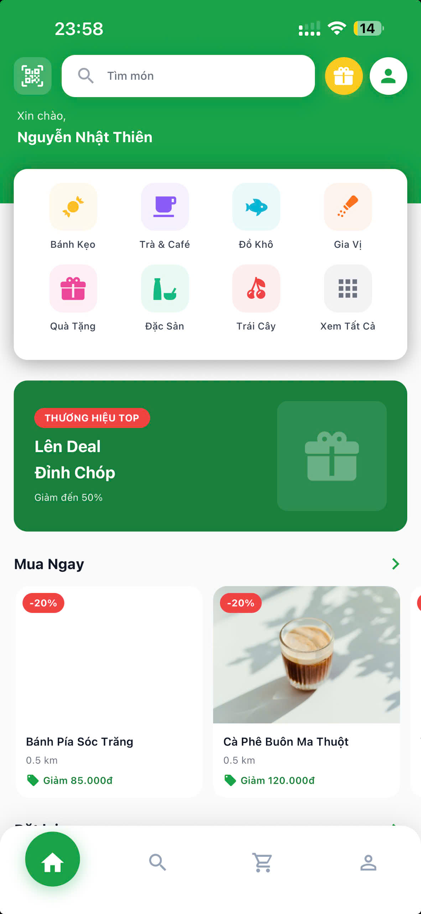
      <br />
      <em>Trang chủ - Phần trên</em>
    </td>
    <td align="center">
      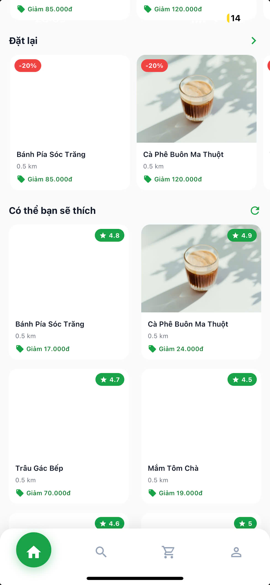
      <br />
      <em>Trang chủ - Phần dưới</em>
    </td>
  </tr>
</table>

<div align="center">
  <em>🎨 Giao diện trang chủ với Grab-inspired design, bao gồm header tìm kiếm, service grid, product sections và promotional banners</em>
</div>

---

### 🔐 Authentication Flow (JWT + OTP)

<table align="center">
  <tr>
    <td align="center">
      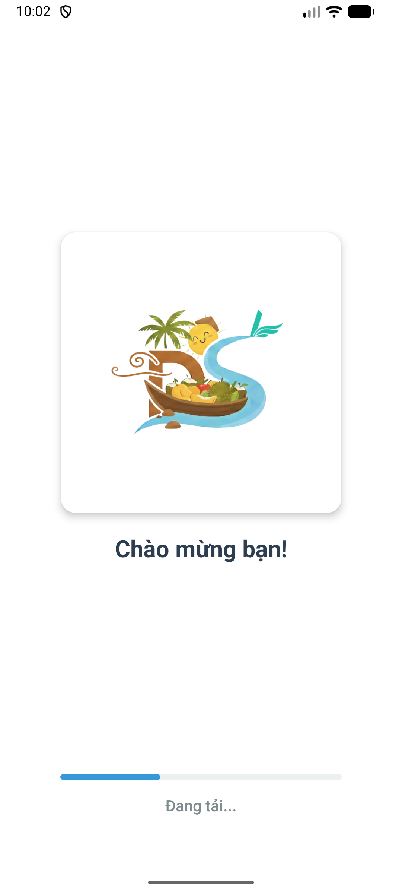
      <br />
      <em>Màn hình loading</em>
    </td>
    <td align="center">
      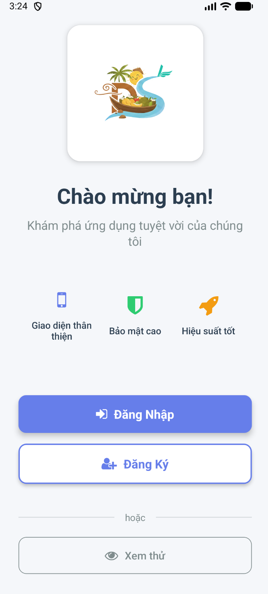
      <br />
      <em>Màn hình Welcome</em>
    </td>
    <td align="center">
      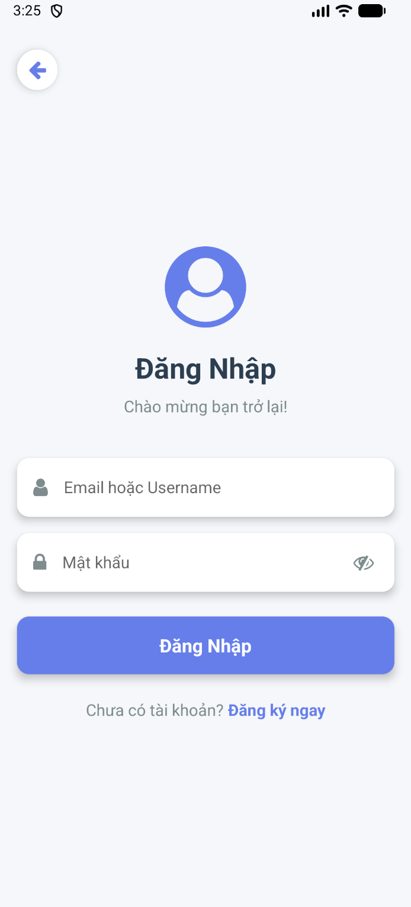
      <br />
      <em>Đăng nhập với JWT</em>
    </td>
  </tr>
  <tr>
    <td align="center">
      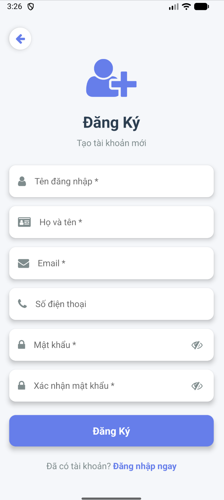
      <br />
      <em>Đăng ký tài khoản</em>
    </td>
    <td align="center">
      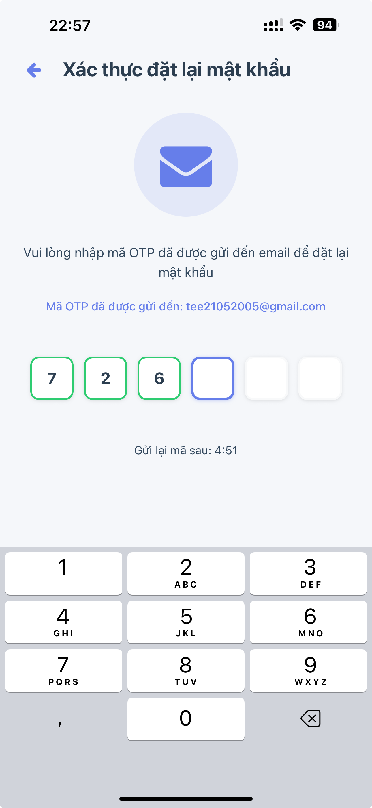
      <br />
      <em>Xác thực OTP 6 số</em>
    </td>
    <td align="center">
      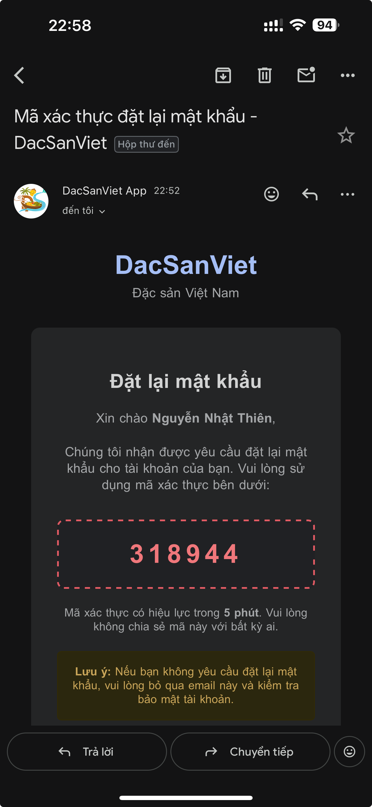
      <br />
      <em>Email OTP nhận được</em>
    </td>
  </tr>
  <tr>
    <td align="center">
      
      <br />
      <em>Quên mật khẩu</em>
    </td>
    <td align="center">
      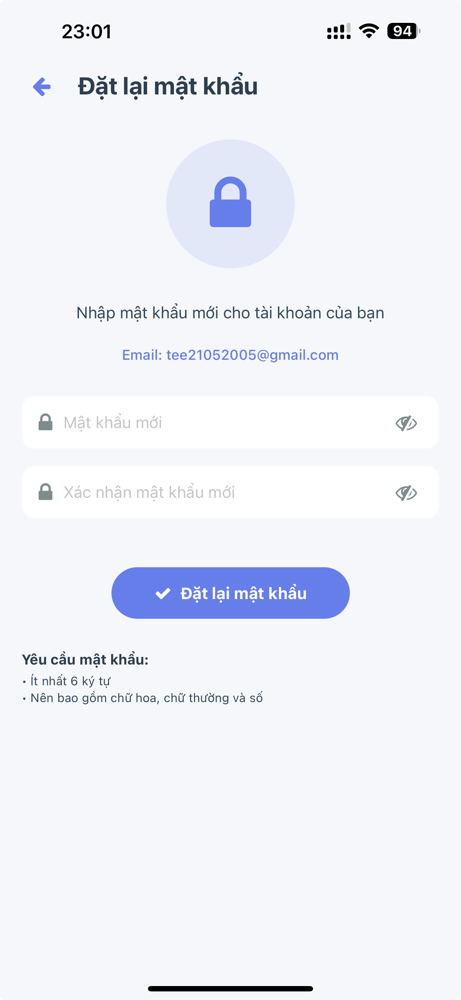
      <br />
      <em>Đặt lại mật khẩu</em>
    </td>
  </tr>
</table>

<div align="center">
  <em>🔒 Hệ thống xác thực hoàn chỉnh với JWT tokens và OTP verification qua email</em>
</div>

---

### 👤 Profile Management System
<table align="center">
  <tr>
    <td align="center">
      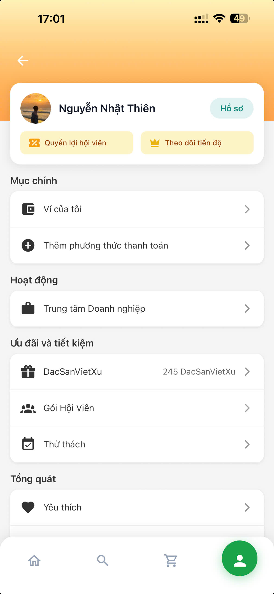
      <br />
      <em>Trang tài khoản</em>
    </td>
    <td align="center">
      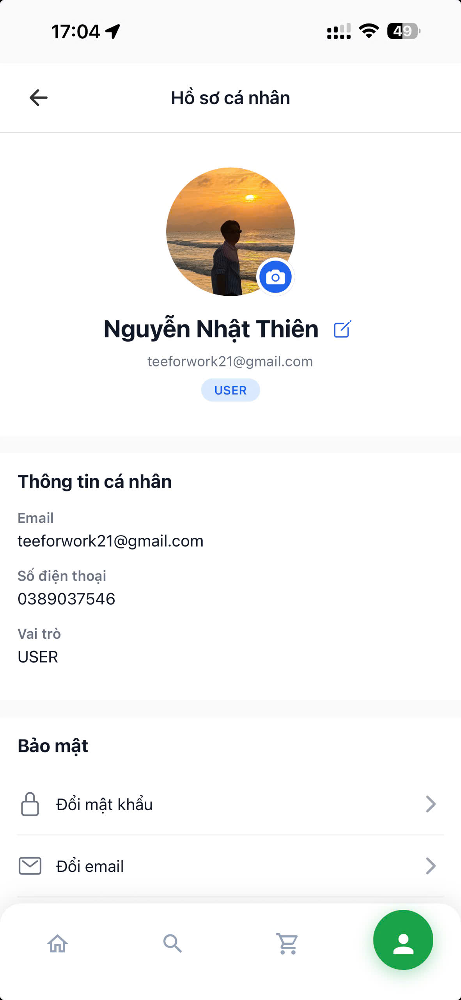
      <br />
      <em>Hồ sơ cá nhân</em>
    </td>
    <td align="center">
      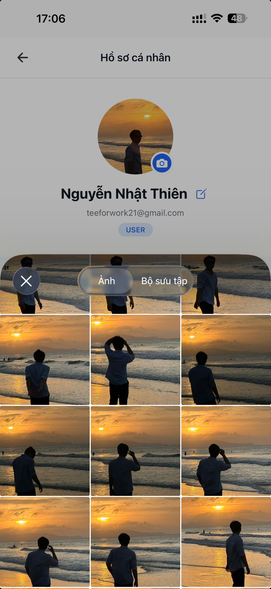
      <br />
      <em>Cập nhật avatar</em>
    </td>
  </tr>
  <tr>
    <td align="center">
      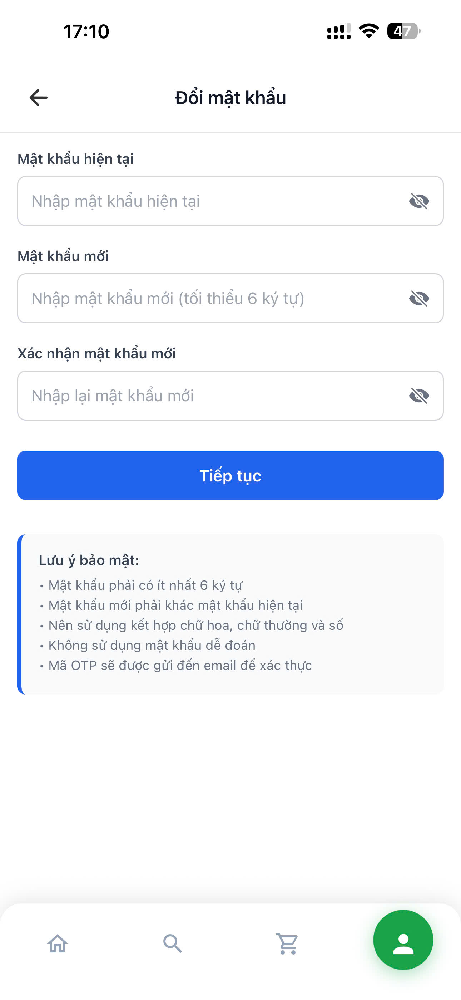
      <br />
      <em>Đổi mật khẩu</em>
    </td>
    <td align="center">
      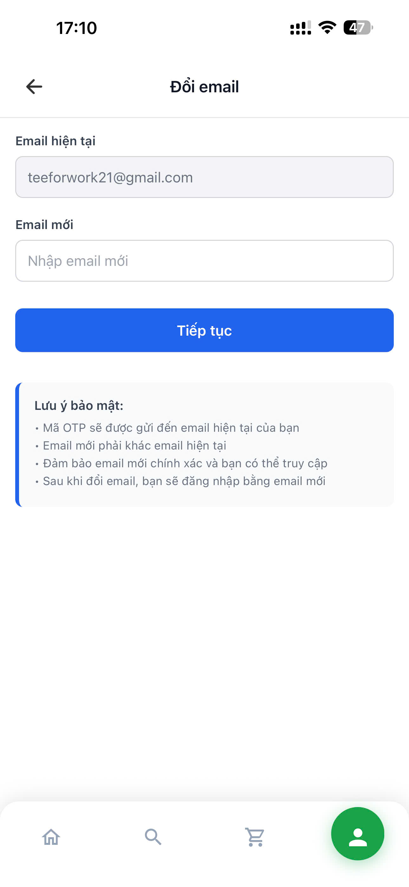
      <br />
      <em>Đổi email</em>
    </td>
    <td align="center">
      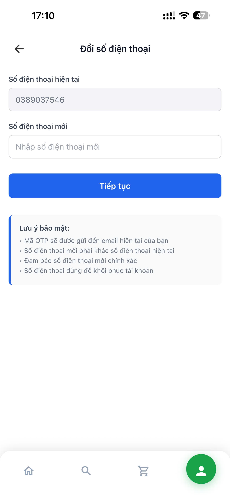
      <br />
      <em>Đổi số điện thoại</em>
    </td>
  </tr>
</table>

<div align="center">
  <em>👤 Hệ thống quản lý profile hoàn chỉnh với avatar upload, inline name editing và JWT-OTP security cho tất cả thay đổi</em>
</div>

---

### 🔐 Security Features (JWT + OTP)

<table align="center">
  <tr>
    <td align="center">
    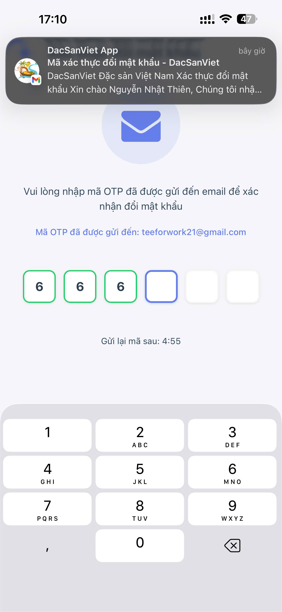
      <br />
      <em>Email OTP cho đổi mật khẩu</em>
    </td>
    <td align="center">
      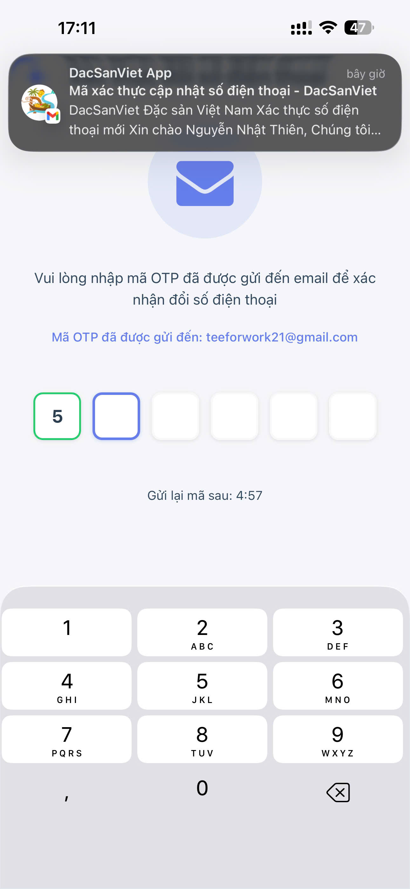
      <br />
      <em>Xác thực OTP đổi SĐT</em>
    </td>
    <td align="center">
      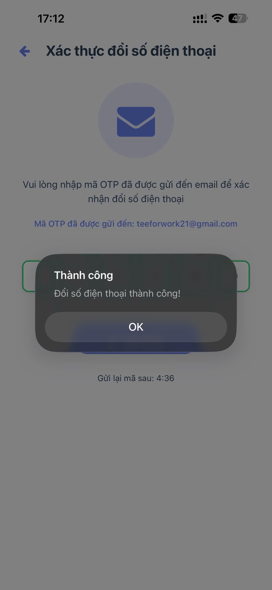
      <br />
      <em>Thông báo thành công</em>
    </td>
  </tr>
</table>

<div align="center">
  <em>🛡️ Bảo mật cao với JWT tokens và OTP verification cho mọi thay đổi profile quan trọng</em>
</div>


## 📝 Changelog

### Version 4.0.0 (Latest) - Profile Management System

- ✅ **NEW**: Complete Profile Management System
- ✅ **NEW**: JWT-OTP Security cho tất cả profile changes
- ✅ **NEW**: Separate screens cho password/email/phone changes
- ✅ **NEW**: Avatar upload với camera icon overlay
- ✅ **NEW**: Inline name editing với save/cancel buttons
- ✅ **NEW**: Account screen với logout functionality
- ✅ **NEW**: OTP verification cho profile security
- ✅ **NEW**: Email changes gửi OTP về email hiện tại (security best practice)
- ✅ **NEW**: Feature-based folder structure (screens/auth, screens/profile, etc.)
- ✅ **NEW**: Centralized exports với index.ts files
- ✅ **IMPROVED**: Navigation flow với ProfileStack
- ✅ **IMPROVED**: UI/UX consistency across all screens
- ✅ **IMPROVED**: Error handling và loading states
- ✅ **IMPROVED**: Code organization và maintainability

### Version 3.0.0

- ✅ **NEW**: Grab-inspired Homepage UI với modern design
- ✅ **NEW**: Modular component architecture (6 reusable components)
- ✅ **NEW**: NativeWind (Tailwind CSS) integration
- ✅ **NEW**: User Profile Modal với thông tin chi tiết
- ✅ **NEW**: Custom Bottom Tab Bar với animations
- ✅ **NEW**: Product sections với real images
- ✅ **NEW**: Service Grid 4x2 layout
- ✅ **NEW**: Promotional banner component
- ✅ **IMPROVED**: Status bar styling (green background)
- ✅ **IMPROVED**: Code organization và maintainability

### Version 2.0.0

- ✅ **NEW**: TypeScript integration hoàn chỉnh
- ✅ **NEW**: JWT Authentication với Access & Refresh tokens
- ✅ **NEW**: OTP verification qua email
- ✅ **NEW**: Custom OTP Input component với UI đẹp
- ✅ **NEW**: Reset password flow hoàn chỉnh
- ✅ **NEW**: API integration với MySQL backend
- ✅ **IMPROVED**: Error handling và validation
- ✅ **IMPROVED**: UI/UX với modern design
- ✅ **IMPROVED**: Navigation flow tối ưu

### Version 1.0.0

- ✅ Basic React Native app
- ✅ Simple authentication
- ✅ Basic UI components

## 🤝 Đóng góp

1. Fork project
2. Tạo feature branch
3. Commit changes
4. Push to branch
5. Create Pull Request

## 🧑‍💻 Tác giả

**Nguyễn Nhật Thiên (TEE)**

- 📧 Email: teeforwork21@gmail.com
- 🔗 GitHub: [github.com/teehihi](https://github.com/teehihi)
- 🌐 Linktree: [linktr.ee/nkqt.tee](https://linktr.ee/nkqt.tee)

---

<div align="center">

**⭐ Nếu bạn thích dự án này, hãy cho chúng tôi một star! ⭐**

Made with ❤️ by Tee

</div>
